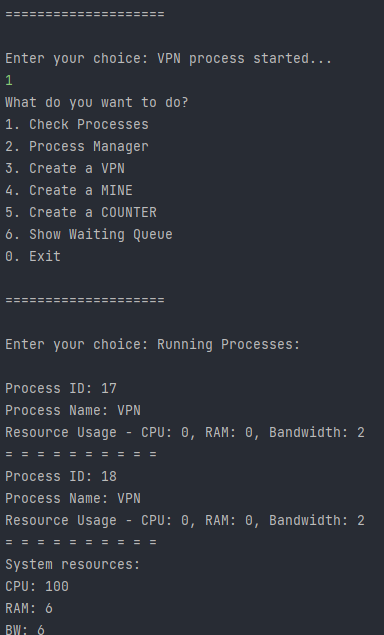

# Concurrency-Threading-OS
Simple concurrency project with threading in java of Shiraz university OS-Lab course.

<h1 align="center">OS Lab Final Project</h1>

  This project is a simulation of an operating system (OS) with process management functionalities. It allows you to monitor running processes, manage their execution, and simulate resource usage.

## Project Overview

The project consists of the following classes:

- `ProcessCheck`: Monitors all currently running processes with information about their resource usage.
- `ProcessManager`: Manages a specific process by applying a given command to it (e.g., kill, suspend, sleep).
- `VPN`: Simulates a VPN process with resource usage.
- `Mine`: Simulates a mining process with resource usage.
- `Counter`: Simulates a counting process with resource usage.
- `OS`: The main class that represents the operating system. It manages the running and waiting processes, checks resource availability, and provides a command-line interface for interacting with the system.

## Getting Started

To run the project locally, follow these steps:

1. Make sure you have Java Development Kit (JDK) installed on your system.
2. Clone the repository from GitHub.
3. Open the project in your preferred Java development environment (e.g., Eclipse, IntelliJ, Visual Studio Code with Java extensions).
4. Compile and run the `OS.java` file, which contains the main method.

## Usage

The project provides a command-line interface to interact with the operating system. Upon running the program, you will be presented with a menu of options:

1. **Check Processes**: Displays information about currently running processes and system resources.
2. **Process Manager**: Allows you to manage a specific process by providing the process ID and command (e.g., kill, suspend, sleep).
3. **Create a VPN**: Simulates the creation of a VPN process.
4. **Create a MINE**: Simulates the creation of a mining process.
5. **Create a COUNTER**: Simulates the creation of a counting process.
6. **Show Waiting Queue**: Displays the list of processes currently in the waiting queue.
0. **Exit**: Terminates the program.

Choose the desired option by entering the corresponding number and follow the instructions provided by the program.

  

## Contributing

Contributions to the project are welcome! If you find any issues or have suggestions for improvements, please feel free to submit a pull request or open an issue on the GitHub repository.

## License

This project is licensed under the [MIT License](LICENSE).

